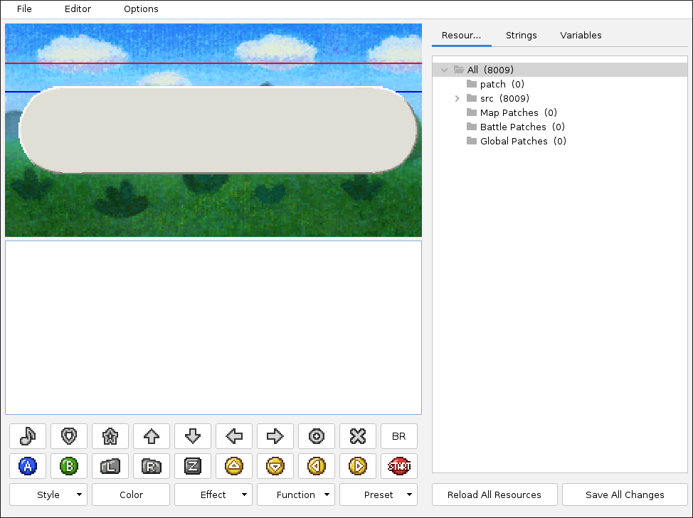
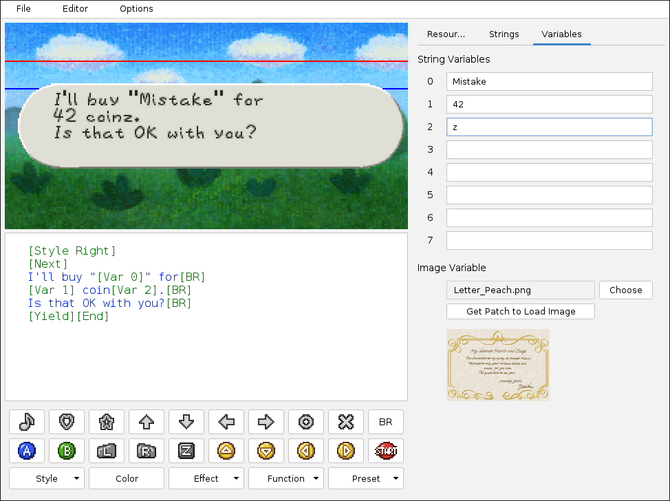

# Star Rod String Editor

## Overview

Within the String Editor you can view and modify existing ingame text and create entirely new text to display.
Text in Paper Mario uses a special string format which Star Rod translates into a custom markup language.

In the center on the left you can edit the current string.
In the bottom left you can add special characters and formatting.
In the top left a preview of how the current string will behave ingame is displayed.
On the right three tabs show different sub-menues: `Resources`,  `Strings` and `Variables`.

### Resources tab

The `Resources` tab scans your mod folder for references to ingame text and lists all occurrences it can find.
The `src` directory lists all strings of the original Paper Mario, ordered within several sub-groups. This directory is for reference only and strings in here should not be modified.
The `patch` directory lists all strings you added or changed using string patch files. This is the place changed or added strings are usually put in.
The `Map Patches` directory lists all strings declared directly within map patch files.
The `Battle Patches` directory lists all strings declared directly within battle patch files.
The `Global Patches` directory lists all strings declared directly within global patch files.
As implied above, it is possible to declare strings directly within patch files for maps, battles, or globals. Whether you want to have a string saved in the same file it is used in, or saved in a separate string patch file, is up to you.

You can select a sub-category by left-clicking on it. This will filter all the strings listed in the `Strings` tab to only show those of your selection.

### Strings tab

The `Strings` tab shows all strings in your currently selected sub-category from the `Resources`tab.
You can select a string by left-clicking on it.

Non-printing characters are represented by tags enclosed by square brackets with colon-separated parameters. Tags are used for special characters, such as symbols and button icons like [C-LEFT]; pauses or delays in printing like [PAUSE]; and more complex formatting functions which modify text size/color/etc.
Each string has a unique identifier which includes a 16-bit section ID and a 16-bit message ID. For example, string 001C0002 is message 2 in section 1C.

You can click into a block of the currently shown string to have the string preview above display that block, including any formatting you have chosen. The currently previewed block gets colored blue to show that it is currently selected.

### Variables tab

The `Variables` tab lets you test the current string's variable text.
When a string has any of the `[Var X]` tags (0-7), then these can be filled dynamically by map or battle scripting, instead of needing different versions of static strings.
This functionality is used, for example, for shop keeper dialogue and the item sockets on Shiver Mountain.

## Modifying and Adding Text

Any existing string can be modified or overwritten using text files in your mod's `strings/` directory or by defining strings with battle or map script files.
New strings can be added in the same way, you just have to make sure their string ID is not already in use (otherwise it will overwrite any existing string with the same ID).
